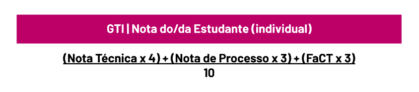

# Notas
## Informações
* A partir de 2023.2, a nota de **Projetos** não incide em nenhum percentual na nota das demais disciplinas.

* Nota inferior a **três (3)** em **Projeto**, a reprovação na disciplina é automática, **sem direito à Prova Final.**

* Pedidos de revisão de prova deve ser feito no **prazo máximo de 03 (três) dias úteis** após a resposta via requerimento acadêmico pela Secretaria da IES.

* Estudante que faltar avaliação presencial poderá solicitar 2a chamada.

## Nota das Disciplinas
* A nota das **Disciplinas** é composta por 2 (duas) avaliações, sendo elas:
  * **Atividades Online**: soma de todas as 4 unidades realizadas durante o bimestre, 4 pontos (quatro)
  * **Prova Escrita**: 6 pontos (seis) 

O cálculo sendo feito da seguinte forma:

> A quantidade e o peso das questões da **Prova Escrita** é definida pelo professor da disciplina.

## Nota Projetos
### Nota do Grupo
* A nota do **Grupo** é composta por 2 (duas) avaliações, sendo elas:
  * **Nota de Processo**: peso 4 (quatro)
  * **Nota Técnica**: peso 6 (seis) 
O cálculo sendo feito da seguinte forma:

### Nota Individual
* A nota **Individual** é composta por 3 (três) avaliações, sendo elas:
  * **Nota de Processo**: peso 3 (três)
  * **Nota Técnica**: peso 4 (quatro) 
  * **FaCT (Fator de Contribuição Técnica)**: peso 3 (três)
O cálculo sendo feito da seguinte forma:

### FaCT 
O FaCT de cada estudante é calculado a partir da avaliação dos/as integrantes do grupo, onde cada membro da equipe avalia o percentual de contribuição dos seus/suas colegas sob seis critérios avaliativos:

• Pensamento crítico e criatividade (0-20%)

• Comunicação (0-20%)

• Colaboração (0-20%)

• Entregas e prazos (0-10%)

• Qualidade das entregas (0-20%)

• Presença (0-10%)

