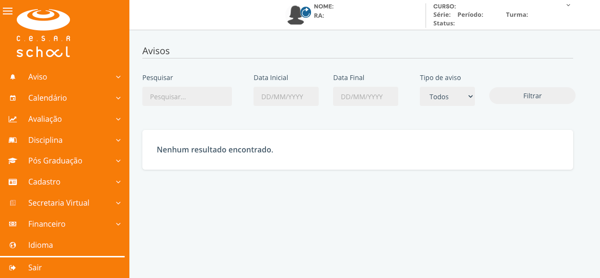

# Apresentação

O Manual de Sobrevivência é um projeto feito por alunos do curso de Gestão da Tecnologia da Informação do CESAR SCHOOL para ajudar os novatos a se adaptarem à universidade. Ele oferece dicas práticas sobre a estrutura do curso, como lidar com o estudo e equilibrar vida acadêmica e pessoal. É uma forma de compartilhar experiências e criar uma comunidade mais unida entre os estudantes.

# Primeiros passos
## Documentação Pendente

Sua próxima tarefa antes de iniciar as aulas, é revisar se os documentos enviados durante sua matrícula foram todos aceitos ou precisam ser reenviados.

Você só conseguirá verificar se algum documento foi recusado após receber seu login **@cesar.school** (isso pode levar até **96h úteis** após a compensação bancária do seu pagamento).

A partir do momento que você receber suas credenciais da School, você poderá deixar de lado o Portal de Matrícula e passar a utilizar somente o Portal Acadêmico (o link será enviado por e-mail com o título: **"Seu e-mail CESAR School foi criado."**).

Em caso de dúvida sobre o motivo detalhado da recusa do documento enviado, envie um e-mail para [contato@cesar.school](mailto:contato@cesar.school) com **seu nome completo, CPF e sua dúvida**.

Para que uma pessoa candidata tenha seu status alterado de pré-matriculada para matriculada, ela precisa cumprir 3 requisitos:

- Ter o boleto da matrícula pago até a data de vencimento;
- Ter aceitado o contrato disponibilizado no momento da matrícula; e
- Ter obtido o aceite, por parte da Secretaria Acadêmica, de todos os documentos obrigatórios enviados durante a matrícula.

Para verificar se algum documento precisa ser reenviado, acesse o **Portal Acadêmico > Cadastro > Documentos.**

> [FAQ Matrícula](https://sites.google.com/cesar.school/graduacao/matr%C3%ADcula/faq)  

## Login no Portal Acadêmico

Para conseguir logar no Portal Acadêmico, será necessário o seu e-mail **@cesar.school**.

1. **Verificação do E-mail de Criação da Conta:**
   Procure na caixa de entrada do e-mail que você forneceu no seu primeiro contato, incluindo as caixas de spam, promoções, atualizações, etc. O título do e-mail que contém seu login e senha do e-mail **@cesar.school** é: **"Seu e-mail CESAR School foi criado."**

2. **Acesso ao E-mail @cesar.school:**
   * Vá para www.gmail.com.
   * Insira seu login e senha para acessar seu e-mail **@cesar.school**.

3. **Acesso ao Portal Acadêmico:**
   * Em uma nova aba, cole o endereço do Portal Acadêmico, ou clique [aqui](https://cesar.lyceum.com.br/AOnline3/#/home/avisos).
   * Faça o login usando sua conta **@cesar.school**, conforme demonstrado na imagem a seguir:

   

   Pronto, você está acessando o Portal Acadêmico, local em que poderá:

    * verificar notas e faltas;

    * imprimir boletos;

    * fazer acordos para os boletos vencidos;

    * olhar as disciplinas matriculadas;

    * solicitar declaração de matrícula.

Entre outros serviços, que em breve estarão disponíveis.

## Campus
Brum, Avenida Cais do Apolo, 77, Recife.

> :warning: **Importante**: Todos os demais avisos e comunicados serão feitos via AVA e e-mail de domínio School (@cesar.school), que são canais oficiais de comunicação. 

>> É preciso estar atento ao e-mail institucional, pois é por ele que você recebe todas as informações sobre o curso de GTI e todas as ações que o CESAR promove (Eventos, Summer Job e etc).
