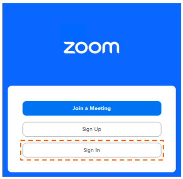
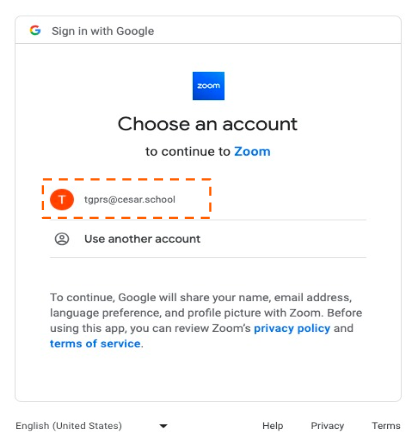
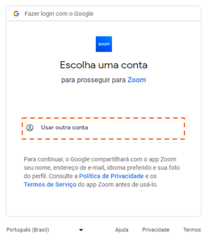
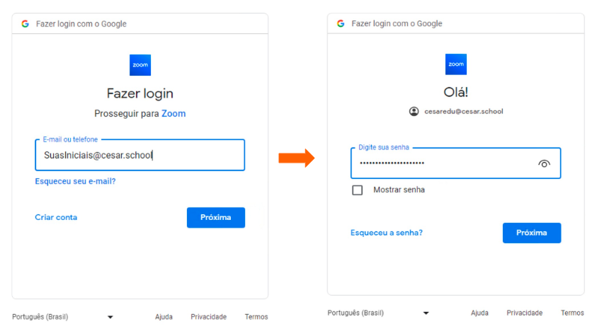
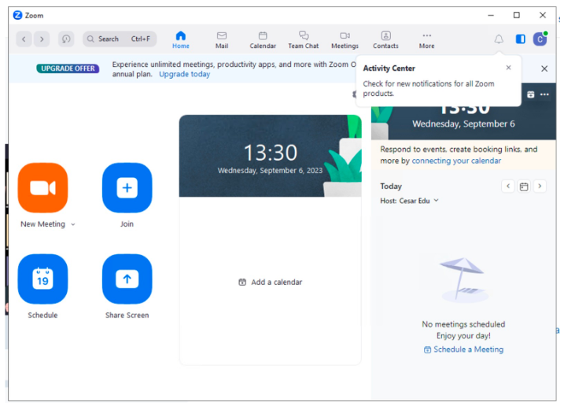
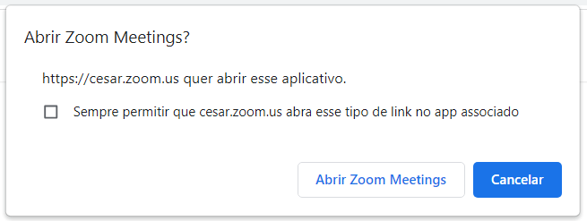

# Aulas Online
O acesso às aulas no Zoom só será permitido utilizando o e-mail institucional (**@cesar.school**), essa medida visa garantir a segurança de todo o corpo doscente e discente nas diretrizes de Lei Geral de Proteção de Dados (LGPD).

Recomendamos que vocês testem o acesso ao e-mail institucional **antes da sua próxima aula**. O acesso é através do Gmail, e caso você tenha esquecido a senha, basta seguir o processo de recuperação de senha indicado ao tentar fazer o login. Um código de verificação será enviado para o e-mail pessoal informado durante a matrícula na CESAR School.

O login no Zoom através do e-mail institucional pode ser feito diretamente pelo acesso via Google. **É simples e você não precisa criar uma conta no Zoom utilizando este e-mail**. Preparamos um tutorial para ajudar vocês no processo. Basta seguir os passos a seguir:

1) Caso você ainda não tenha o Zoom instalado no seu computador, acesse o site https://zoom.us/pt/download para download do aplicativo. Após o download, faça a instalação do aplicativo no seu computador, abra o aplicativo e clique em **Sign In** ou **Fazer Login**, conforme a imagem abaixo: 

  

2) Na próxima tela, escolha a opção de **login via Google**, conforme a imagem abaixo:

  

3) Se já estiver conectado ao seu e-mail institucional no navegador, escolha a sua conta @cesar.school para fazer o login no Zoom:

  

4) Caso esteja fazendo login pela primeira vez, é preciso selecionar a opção **Use another account** ou **Usar outra conta**, e fazer o login inserindo seu e-mail @cesar.school e a sua senha:

  

  

5) Em seguida, o Zoom já abrirá conectado em sua conta @cesar.school!

  

Ao acessar o link da aula, seu navegador vai perguntar se você deseja abrir o aplicativo do Zoom. Se você já estiver conectado com o seu e-mail institucional, ele vai seguir direto para você digitar a senha e acessar a aula! 😉 Caso não esteja logado com o e-mail institucional, basta seguir os passos acima e o seu acesso será liberado!

  

> :warning: **Importante:** [Aqui neste endereço](https://lookerstudio.google.com/u/0/reporting/1vjnzENzy31sVF6GJiz1WCUzd2FbLM6gO/page/500IB) estão os links zoom por turma.
